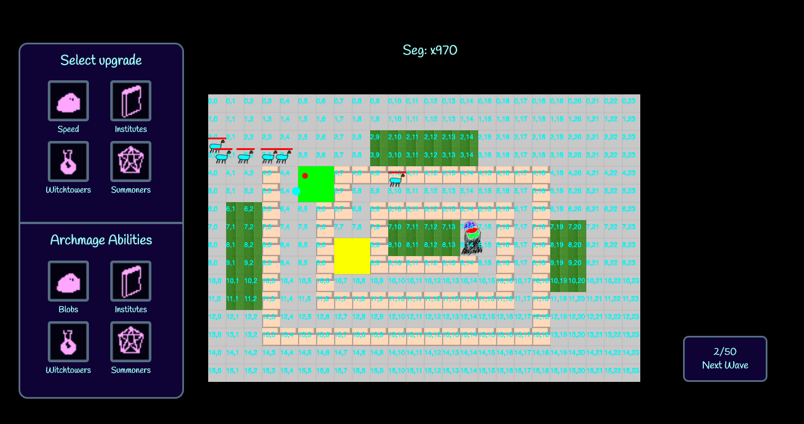

# the_weeping_city

# Archmage's Fortress
  - geographical influences (small barriers, swamp, lightning)
  - (standard)  blobs
  - (support)   witchtowers (self-destructing bombs, tracking spells, curses/special effects, AoE boosts)
  - (mob melee) institutions of magic (send out acolytes/scholars to attack)
  - (DPS)       demon summoners
  - 2x2 tile size

# CONVENTIONS
- `blah.pos` refers to a dictionary {"x": 10, "y": 5} with indexes into the grid. Note: the function `pvec(x, y)` returns a valid position vector.
- mob image files are named `mob_MOBNAME.png`
- tile image files are named `tile_MOBNAME.png`
- icon image files are named `icon_MOBNAME.png`
- `grid[y][x]` refers to the tile at pos `pvec(x,y)`

# Tower descriptions
- witchtowers: long range projectiles, cool spells
  Speed decrease, poison effect, increase surrounding damage
- institutes: release melee units
- demon summoners: splash projectiles 
- blobs: basic projectile shooting
- archmage's fortress: seeking missiles, walls

# Mob
  - basic type
  - speed
  - 1x1 tile size

# TODO

### General

### Alek
  - real projectiles
  - real pathfinding

### Kevin
  - custom on hover info display card for towers (should probably explain what the tower is, and show its stats)

