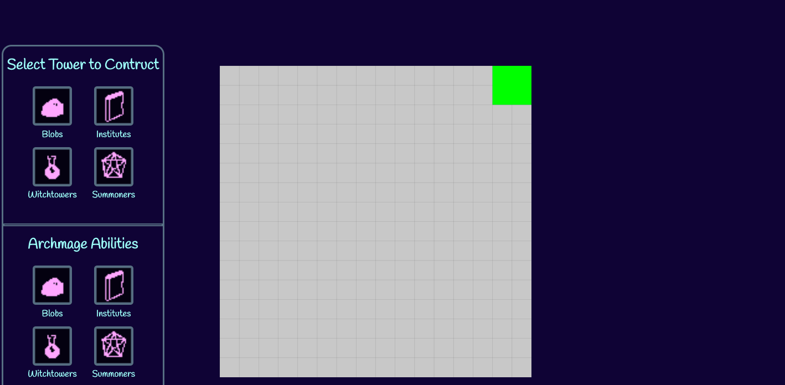

# the_weeping_city

# Archmage's Fortress
  - geographical influences (small barriers, swamp, lightning)
  - (standard)  blobs
  - (support)   witchtowers (self-destructing bombs, tracking spells, curses/special effects, AoE boosts)
  - (mob melee) institutions of magic (send out acolytes/scholars to attack)
  - (DPS)       demon summoners
  - 2x2 tile size

# CONVENTIONS
- `blah.pos` refers to a dictionary {"x": 10, "y": 5} with indexes into the grid. Note: the function `pvec(x, y)` returns a valid position vector.

# Tower descriptions
- witchtowers: long range projectiles, cool spells
  Speed decrease, poison effect, increase surrounding damage
- institutes: release melee units
- demon summoners: splash projectiles 
- blobs: basic projectile shooting
- archmage's fortress: seeking missiles, walls

# Mob
  - basic type
  - speed
  - 1x1 tile size

# TODO

### Alek
  - make it not a square grid
  - towers should shoot stuff (randomly)
  - path map - spiral 
    - costs lives if the mobs get to the end

### Kevin
  - need to make it so that player.startPlacingTower(tower_type) is called onclick of Kevin's interface character card
  - mobs
    - follow path in a line from path[0] to path[1] until you get to path[1], then delete path[0] OR something like this
    - path = [pvec(1,1), pvec(1,10), pvec(15,10)] 
  - HUD
    - seg 
    - lives (number)
    - wave counter

